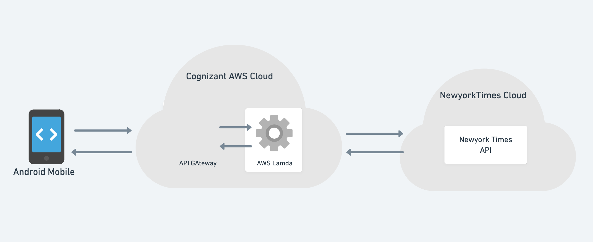

#  CAP-One Android Demo

## API Documentation:  [NewYorkTimes Developers](https://documenter.getpostman.com/view/196489/UVkgxeW6)

This sample application use the **Top Stories** API to fetch an array of articles currently on the specified section (
arts, business, ...).

##### 

---

## The following values are supported article categories
|<!-- --> |<!-- --> |<!-- --> |<!-- --> |
| ------- | ------- | ------- | ------- |
| arts | insider | automobiles | magazine |
| books | movies | business | nyregion |
| fashion | obituaries | food  | opinion |
| health | home | politics | realestate |
| science | sports | sundayreview | technology |
| theater | t-magazine | travel | upshot |
| us | world |

## Proxy Layer Implementation
Instead of accessing NewYorkTimes API's directly from our mobile application, 
we have implemented a proxy layer in our cognizant backend and that will route our application's API calls to the NewYorkTimes developer service.

